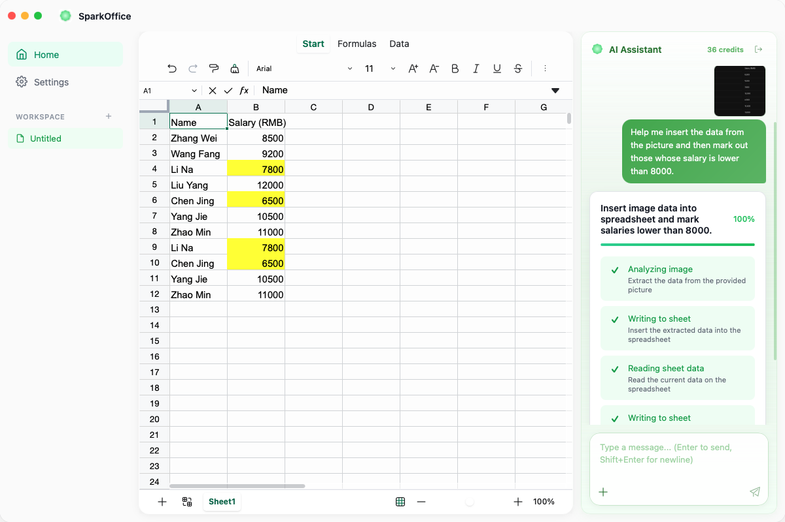

# SparkOffice

  

  <strong>AI-Native Spreadsheet Workspace</strong>

  Modern spreadsheet software powered by AI workflows, intelligent automation, and a beautiful desktop experience.

---

## Preview

  

---

# Features

### ✨ AI Spreadsheet Assistant
Use natural language to:
- Analyze spreadsheet data
- Generate formulas
- Clean and organize tables
- Highlight conditions automatically
- Summarize large datasets

---

### ⚡ Native Desktop Performance
Built with:
- Tauri
- Vue 3
- Rust

Ultra-fast startup speed with low memory usage.

---

### 🧠 AI Workflow Engine
Visual multi-step AI operations:
- Read spreadsheet
- Analyze data
- Generate actions
- Apply modifications automatically

---

### 📷 OCR Table Import
Import spreadsheet data directly from:
- Images
- Screenshots
- Documents

AI automatically extracts and formats the table.

---

# Downloads

## macOS

Universal build for:
- Apple Silicon (M1 / M2 / M3)
- Intel Macs

👉 [Download Latest Version](../../releases/latest)

---

## Windows

Windows version is coming soon.

---

## Linux

Linux version is not available yet.

---

# Release Notes

Latest releases:

👉 [View Releases](../../releases)

---

# Tech Stack

- Tauri
- Vue 3
- Rust
- TypeScript
- AI Workflow Engine
- Spreadsheet Runtime

---

# Community

Coming soon:
- Discord Community
- Plugin Ecosystem
- AI Workflow Sharing

---

# License

This repository only contains binary releases.

Source code is private.

